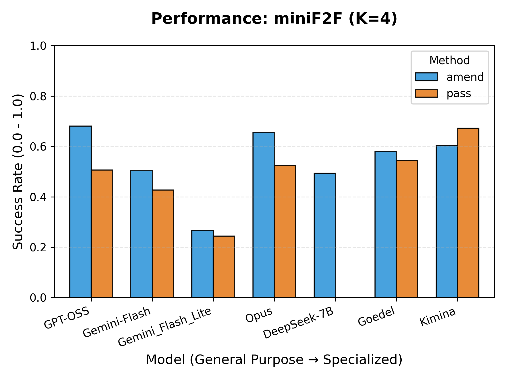

# Testing Large Language Models’ Autoformalization Capabilities in LEAN

A [UW Math AI Lab](https://github.com/uw-math-ai) project.

Within the past few years, the ability of Large Language Models (LLMs) to generate formal mathematical proofs has improved drastically. We will provide a comparison of various LLMs' effectiveness in producing a successful proof in the Lean 4 theorem prover on both Mini-F2F and Mini-CTX datasets. Specifically, we will compare three general purpose LLMs: Gemini 3-pro, Chat GPT 5.2, Claude 4.5 Opus, and three specialized LLMs: Kimina-72B, Goedel-Prover-32B, Deepseek-Prover-V2-7B. We plan to test each models effectiveness at Pass@4, and multi turn proof generation with $k=4$. Finally, we will analyze the cost, the number of tokens and the latency time to provide the optimal model given the available resources of the users. 

[Winter Quarter Poster](https://docs.google.com/presentation/d/1dIf4-OZg-ClmAyEdQqRi9oxUBDifUnVM1fhT3GzvC4A/edit?usp=sharing_)

## Results

