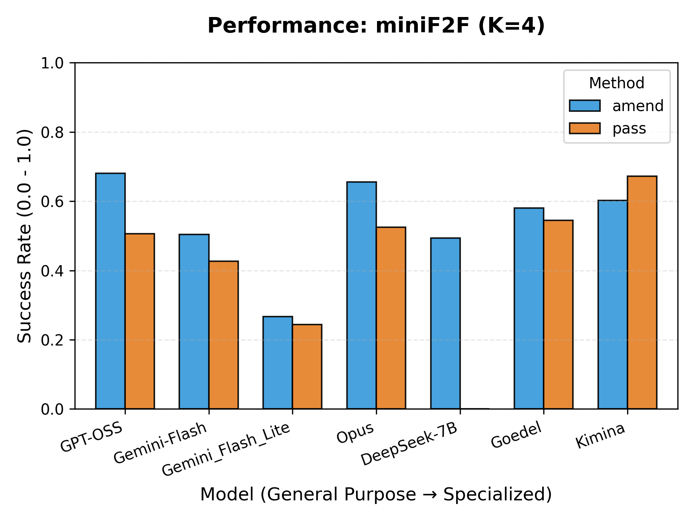

# Testing Large Language Models’ Autoformalization Capabilities in LEAN

<!--A [UW Math AI Lab](https://github.com/uw-math-ai) project.-->

Within the past few years, the ability of large language models (LLMs) to generate formal mathematical proofs has improved drastically. We will provide a comparison of various LLMs' effectiveness in producing a successful proof in Lean 4 on a size $n=50$ unbiased subset on both Mini-F2F and Mini-CTX datasets. Specifically, we compare a variety of LLMs spanning from Propreitary Frontier, Open-Weights General-Purpose, and Lean Specialized models. See Supported Models below for a complete list. We test each models effectiveness at formal proof generation in Lean 4 using the Pass@k and Refine@k benchmarks up to $k = 32.$ We also analyze the cost so the user can make an informed bescision given the available resources. 

<!--[Winter Quarter Poster](https://docs.google.com/presentation/d/1dIf4-OZg-ClmAyEdQqRi9oxUBDifUnVM1fhT3GzvC4A/edit?usp=sharing_)-->

## Instructions

### Setup
python 3.12 (with a virtual environment: [Tutorial](https://www.w3schools.com/python/python_virtualenv.asp))\
```pip install -r requirements.txt```\
```mkdir data/Final\ Tests```\
```install-lean```\
```source ~/.profile```
### Usage
All relevant files are intended to be run from ```/winter```
#### To run on a smaller dataset of size x:
```python3 utils/gen_small_dataset.py [x]```\
```python3 run.py [model] [True/False (refine@k/pass@k)] [workers] [loops] ```

#### Parameters
[model]: Model to evaluate. See Supported Models.\
[True/False (refine@k/pass@k)]: Whether to use refine@k (True) or Pass@k (False)\
[workers]: Number of workers for parallel model calls (default 4). Increase for faster evaluation, decrease if encountering rate limits.\
[loops]: The number of iterations (k)

#### To run on a full dataset:
```python3 run.py --final [model] [True/False (refine@k/pass@k)] [C/F] [workers] [loops] ```

#### Parameters
[model]: Model to evaluate. See Supported Models.\
[True/False (refine@k/pass@k)]: Whether to use refine@k (True) or Pass@k (False)\
[C/F]: Whether to run on miniCTX (C) or minif2f (F)\
[workers]: Number of workers for parallel model calls (default 4). Increase for faster evaluation, decrease if encountering rate limits.\
[loops]: The number of iterations (k)


### Supported Models

sonnet: Claude Sonnet 4.5\
opus: Claude Opus 4.5\
gpt: GPT 5.1\
gemini: Google Gemini 3-flash-preview\
gemini_pro: Google Gemini 3.1-pro-preview\
gemini_lite: Google Gemini 3.1-flash-lite-preview\
qwen: qwen.qwen3-32b-v1:0\
gpt_oss: openai/gpt-oss-120b\
leanstral: mistralai:labs-leanstral-2603\
nemotron: nvidia/nemotron-3-super-120b-a12b\
qwen: Qwen/Qwen3.5-397B-A17B\
deepseek: deepseek-ai/DeepSeek-V3.2\
glm: zai-org/GLM-5\
minimax: MiniMaxAI/MiniMax-M2.1\
kimi: moonshotai/Kimi-K2-Thinking

## Results



